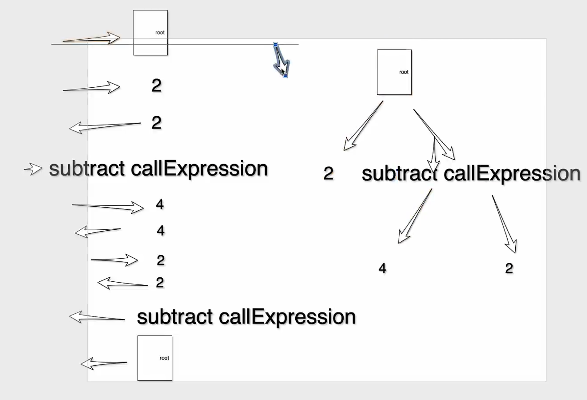
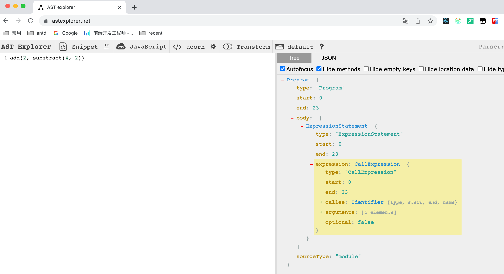
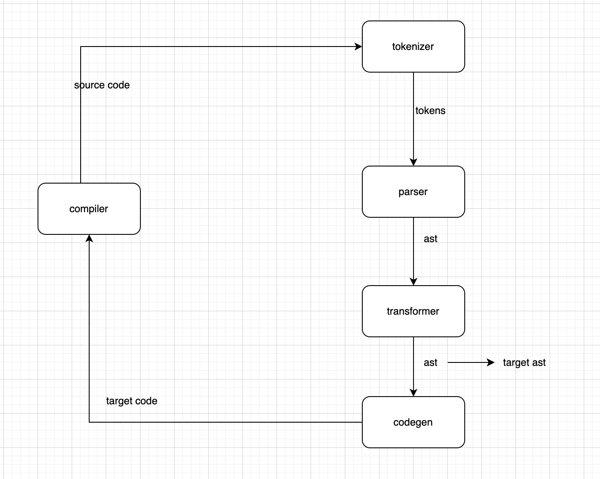

# tiny-complier

实现超级 mini 的编译器 | codegen&amp;compiler 生成代码 | 只需要 200 行代码 | 前端学习编译原理的最佳案例

https://github.com/jamiebuilds/the-super-tiny-compiler

https://github.com/cuixiaorui/the-tutorial-super-tiny-compiler


# 词法分析 tokenizer


```ts
test('tokenizer', () => {
    const code = `(add 2 (subtract 4 2))`
    const tokens = [
        { type: TokenTypes.Paren, value: '(' },
        { type: TokenTypes.Name, value: 'add' },
        { type: TokenTypes.Number, value: '2' },
        { type: TokenTypes.Paren, value: '(' },
        { type: TokenTypes.Name, value: 'subtract' },
        { type: TokenTypes.Number, value: '4' },
        { type: TokenTypes.Number, value: '2' },
        { type: TokenTypes.Paren, value: ')' },
        { type: TokenTypes.Paren, value: ')' },
    ]
    expect(tokenizer(code)).toEqual(tokens)
})
```

# 语法分析 parser

```ts
 it("parser tokens to ast", () => {
    const tokens = [
      { type: TokenTypes.Paren, value: "(" },
      { type: TokenTypes.Name, value: "add" },
      { type: TokenTypes.Number, value: "2" },
      { type: TokenTypes.Paren, value: "(" },
      { type: TokenTypes.Name, value: "subtract" },
      { type: TokenTypes.Number, value: "4" },
      { type: TokenTypes.Number, value: "2" },
      { type: TokenTypes.Paren, value: ")" },
      { type: TokenTypes.Paren, value: ")" },
    ];
    const ast = {
      type: NodeTypes.Program,
      body: [
        {
          type: NodeTypes.CallExpression,
          name: "add",
          params: [
            {
              type: NodeTypes.NumberLiteral,
              value: "2",
            },
            {
              type: NodeTypes.CallExpression,
              name: "subtract",
              params: [
                {
                  type: NodeTypes.NumberLiteral,
                  value: "4",
                },
                {
                  type: NodeTypes.NumberLiteral,
                  value: "2",
                },
              ],
            },
          ],
        },
      ],
    };
    expect(parser(tokens)).toEqual(ast);
  });
```


# traverser 遍历 AST


# transform 转换 AST 

https://astexplorer.net/



# codegen&compiler 生成代码

